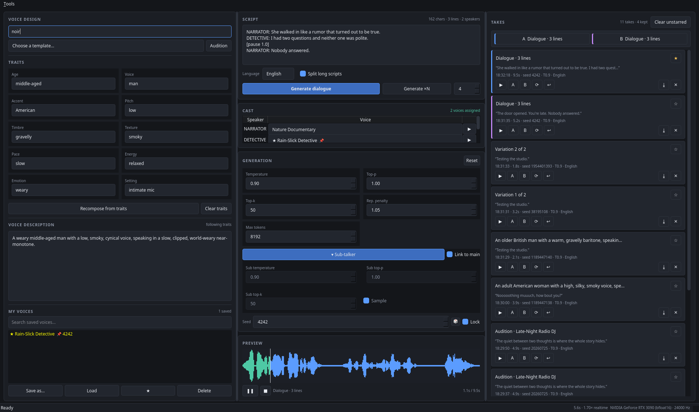

# Voice Design Studio

A desktop studio for **Qwen3-TTS-12Hz-1.7B-VoiceDesign** — the TTS model where you
*describe* a voice in plain language instead of picking one from a list.

Because the voice comes from a text description, the real work is iterative:
write a description, listen, change a word, compare against the last take. The app
is built around that loop rather than around a single "Generate" button.



## What's in it

**Voice design (left).** Twenty built-in templates across Narration, Informational,
Commercial, Character, and Stylized categories — pick one instead of facing an empty
box. A trait builder (age, accent, pitch, timbre, texture, pace, energy, emotion,
setting) composes an English sentence into the description field, which stays fully
editable; editing by hand detaches it from the traits rather than fighting them.
**Audition** generates any template against a fixed demo line and seed, so the picker
doubles as a browsable voice catalogue. Save anything you like into **My Voices** —
that forks a copy, so built-in templates are never modified. A **VOICE PROFILE**
section pins a speaker exactly: import (or drag-drop) a reference `.wav`, or
**Extract Voice Profile** from the current description, and every line is then
conditioned on one fixed speaker embedding instead of re-deriving a voice from
text — see *Keeping a voice steady* below.

**Script and preview (center).** The text to speak, a language selector (11 options
reported by the model), and sampling controls. Scripts up to **1500 characters
generate in a single pass**, so most narration has no joins at all; longer ones split
on sentence boundaries and are crossfaded together. The waveform is click-to-seek.

A collapsible **Sub-talker** section exposes the model's second sampling stage,
which predicts the residual codebooks carrying acoustic detail. It's linked to the
main controls by default, matching the checkpoint's own behaviour. Measurement
([subtalker_sweep.py](scripts/subtalker_sweep.py)) found these settings change the
rendition substantially but with no consistent direction across 0.2–1.5 — treat it
as a second exploration axis, not a quality dial. **Max tokens** is a ceiling on
codec frames (~12 per second of audio); a take that hits it is cut off mid-word and
is now flagged as truncated instead of passing for a short take.

**Multi-voice dialogue.** Write a screenplay-style script and each character gets
its own voice:

```
NARRATOR: The door opened.
VILLAIN: You're late.
  And I don't like waiting.
[pause 1.5]
NARRATOR: Nobody answered.
```

Speaker labels are detected automatically, a **Cast** table appears, and you map
each speaker to a voice. The list is grouped — **My voices** (everything in your
library, favourites starred and seed-pinned entries marked 📌) above the built-in
**Templates** — and it updates the moment you save a new voice, so you can design a
character and cast it without reloading. Indented lines continue the previous
speaker; `[pause N]` inserts silence; a longer beat is left automatically when the
speaker changes. Generation refuses up front if any speaker is unassigned rather
than failing halfway through, and deleting a voice that was cast unassigns that
speaker rather than silently substituting a different one. **Tools → Export dialogue
stems** writes one WAV per line plus a `cue_sheet.tsv` of line timings for a video or
game editor.

### Why chunk joins used to be audible

For a *single-voice* script the voice barely drifts between chunks — measured
timbre difference is ~0.02, well below the metric's ~0.07 noise floor, and level
varies by 0.14 dB. Neither is what you hear.

The seam is **prosodic**. Each chunk is generated as an independent utterance, so
it ends on a terminal pitch fall and the next begins with a pitch reset. Measured
at the same sentence boundary ([seam_study.py](scripts/seam_study.py)): the pitch
jumps **65 Hz across a chunk join** but only **32 Hz inside a single pass** — twice
the discontinuity. No amount of gap tuning fixes that, because the phrasing itself
restarts.

So the fix is fewer chunks. The old 300-character limit was ~8× more conservative
than necessary: this checkpoint renders **2458 characters in one pass** (172 s of
audio, 26% of the token budget) before it starts dropping text at ~3650. The limit
is now **1500**, keeping a wide margin while letting most scripts through seam-free.
Where a join is still needed, chunks are joined with a 15 ms equal-power crossfade
and no added silence — they already carry their own pause from the sentence
boundary they were split on, and stacking more on top only widened the gap.

### Keeping a voice steady

A description keeps a character broadly recognisable, but it does not pin the
voice — generate the same description twice and you get two slightly different
readings. Across a scene that drift is audible, and it's the main thing that makes
multi-voice output sound wrong.

The VoiceDesign checkpoint offers no speaker-locking mechanism to fix it directly:
it ships no speaker encoder, so `extract_speaker_embedding` fails there. Two
mechanisms in the studio work around that, one exact and one statistical.

**Voice profiles (exact).** The **Base** checkpoint of the same family *does* carry
a speaker encoder plus embedding-conditioned generation, and the studio loads it
lazily the first time you use a profile. Either drop/import a reference `.wav` into
the **VOICE PROFILE** section, or click **Extract Voice Profile** to render a golden
sample of the current description and lock its speaker. The embedding (x-vector) is
extracted **once**, saved to disk, and every subsequent line — single takes,
whole scripts, variations, rerolls — is conditioned on that same fixed vector, so
the speaker cannot shift with the line's text. While a profile is active the talker
temperature is capped at 0.7 (the identity is pinned by the embedding; the cooler
talker keeps the rhythm consistent from line to line), the seed stays uniform
across a script batch, and the description editor is ignored. **Clear** returns to
description mode. Dialogue keeps its per-speaker cast voices — a single embedding
would collapse every character into one speaker.

**Voice locking (statistical, dialogue).** A voice is genuinely fixed *inside a single generation*, because the
audio is one continuous sample. So **Keep each voice steady across its lines** (on by
default) renders all of a speaker's lines in one pass and splits them apart on the
silences between sentences. Measured over an interleaved two-hander
([voice_lock_study.py](scripts/voice_lock_study.py)):

| strategy | drift | drift ÷ character separation |
|---|---|---|
| per-line generation | 0.0745 | 0.20 |
| voice-locked | 0.0511 | 0.14 |

**31% less drift**, consistent across runs. If a split can't be made safely — the
silences aren't clear, or the segment lengths contradict what the text predicts —
that group falls back to line-by-line rather than shipping mis-cut audio, and the
take is labelled to say so.

Two practical consequences. Cast characters whose descriptions differ in *pitch or
age*, not just wording: two similar older men sit about 0.07 apart, barely above the
measurement floor, while a documentary narrator and a children's presenter sit 0.37
apart and never get confused. And turning the toggle off is worth it if you want each
line auditioned independently — it just costs consistency.

**Pronunciation (Ctrl+P).** A separate window with two halves. The **dictionary**
holds respellings — `Qwen` → `Chwen` — with whole-word, case, regex and
per-language options; rules run in list order and can be reordered. Since the model
takes no phoneme input, respelling is the only lever, and the window says so.
**Tuning** generates your test phrase with and without the selected rule and pins
them as A and B, so fixing a pronunciation uses the same compare loop as designing
a voice. The **normalization** half toggles automatic written-to-spoken rewrites:
numbers, ordinals, currency, dates, times, units, initialisms, symbols and
whitespace. Order is fixed — normalize first, your rules last — so a hand-written
rule always wins. A live preview shows the original beside what will actually be
spoken, with per-rule hit counts so dead rules are visible.

**Takes (right).** Every generation becomes a card with its seed and parameters.
Star the good ones, **re-roll** with a new seed, **restore** a take's settings back
into the editor, or export the WAV. Pin any two takes as **A** and **B** and toggle
between them — the fastest way to tell whether a description change actually helped.

**Seed lock** matters more than it sounds: lock the seed and a description edit
becomes the only variable between two takes. Unlock it, hit **Generate ×N**, and you
explore alternative readings of the same voice.

### What carries the voice

Worth knowing before you build a workflow on it, and measurable with
[seed_study.py](scripts/seed_study.py): across two *different* sentences,

| | timbre similarity | mean ΔF0 |
|---|---|---|
| same description, same seed | 0.935 | 6.1 Hz |
| same description, different seed | 0.929 | 2.6 Hz |
| different description | 0.590 | 156.3 Hz |

The **description** carries speaker identity — it stays recognisable at any seed.
The seed pins an exact *rendition*: identical text plus identical seed reproduces
bit-identical audio. So a character stays consistent across a script because its
description is stable, not because a seed is held fixed. Pinning a seed on a saved
voice gets that specific take back; it isn't what keeps the voice together.

## Setup

Requires a CUDA GPU (~6 GB VRAM) and roughly 5 GB of disk for weights.

```bash
python3 -m venv .venv
.venv/bin/pip install -r requirements.txt
./run.sh
```

The first launch downloads ~4.5 GB from the Hugging Face Hub. **After that the app
needs no internet at all** — once every required file is cached it loads from the
local snapshot directory in about a second, and the status bar shows `cached`.

That is deliberate rather than automatic. Two things in the stack contact the Hub
even when nothing needs downloading, and both ignore `local_files_only`:

- the tokenizer's Mistral-regex patch calls `model_info()` unconditionally — but
  only when the path isn't local;
- the model's own `from_pretrained` fetches `speech_tokenizer/*` unless the path is
  already a directory.

So [loader.py](voicestudio/engine/loader.py) resolves the cached snapshot to a
**directory path** and loads from that, which short-circuits both. If the cache is
incomplete it downloads the missing files as usual, and if a load from cache fails
(a truncated blob, say) it retries against the Hub rather than dying.

Set `VOICESTUDIO_OFFLINE=1` to forbid network access outright — the app then fails
with a clear message listing missing files instead of quietly reaching out.
[offline_check.py](scripts/offline_check.py) verifies all of this with the network
blackholed.

Keyboard: `Ctrl+Enter` generate · `Space` play/pause · `Ctrl+S` save voice ·
`Ctrl+1`/`Ctrl+2` play A/B · `Esc` cancel.

## HiDPI

The UI follows your Qt display and font settings. Every size — text, padding,
button widths, the initial window — is derived from the application font
([metrics.py](voicestudio/ui/metrics.py)) rather than hardcoded pixels, so the
whole interface scales together instead of leaving small text in large panels.

That matters because Qt scales device-independent pixels by `devicePixelRatio`
but **not** by font DPI or your chosen system font size, which is how most
desktops actually scale text. Sizing off font metrics covers all three.

Fractional scale factors are preserved (`PassThrough` rounding), so 125% and
150% aren't rounded to 100% or 200%. The usual Qt knobs all work:

```bash
QT_FONT_DPI=144 ./run.sh          # scale text only
QT_SCALE_FACTOR=1.5 ./run.sh      # scale the whole UI
```

If text is still too small, the most direct fix is to raise your desktop's
interface font size — the app picks it up automatically. To preview a size
without changing your desktop:

```bash
QT_QPA_PLATFORM=offscreen .venv/bin/python scripts/screenshot.py --pt 16 --out /tmp/preview.png
```

## How the model is loaded

`qwen3_tts` is **not** part of upstream transformers. The `qwen-tts` package ships
the transformers classes (`Qwen3TTSConfig`, `Qwen3TTSForConditionalGeneration`,
`Qwen3TTSProcessor`) and the app registers them into the transformers `Auto*`
mappings, then loads through the standard path:

```python
AutoConfig.register("qwen3_tts", Qwen3TTSConfig)
AutoModel.register(Qwen3TTSConfig, Qwen3TTSForConditionalGeneration)
AutoProcessor.register(Qwen3TTSConfig, Qwen3TTSProcessor)

model = AutoModel.from_pretrained(MODEL_ID, dtype=torch.bfloat16, device_map="cuda:0")
```

**Do not upgrade `transformers` past 4.57.3.** Version 5.x has no `qwen3_tts` and the
model will fail to load. `qwen-tts` pins this for you.

Generation is driven directly rather than through the `qwen_tts` convenience wrapper,
so the app controls seeding and per-request parameters. A voice description is sent as
a user turn and the spoken text as an assistant turn; the model returns codec tokens
that the bundled speech tokenizer decodes to 24 kHz mono audio. All of this lives in
[voicestudio/engine/](voicestudio/engine/) — the rest of the app never imports
transformers.

## Layout

```
voicestudio/
├── engine/    loader.py (registration + load)  synth.py (prompt, generate, decode)
├── core/      config  library  history  audio  script  templates  traits
│              normalize (written → spoken)  pronounce (rules)  dialogue (parser)
├── assets/    templates.json — the 20 built-in voice descriptions
└── ui/        main_window  design_panel  script_panel  params_panel  cast_panel
               takes_panel  pronounce_window  player  metrics  theme
               workers (QThread model host)
```

A job is a list of items plus a mode saying how their audio combines: one take
(`single`), one joined take (`script`, `dialogue`), or a take per item
(`variations`, `compare`). Dialogue and pronunciation A/B are both that same
machinery, which is why neither needed its own generation path.

Model load and generation run on a worker `QThread`; the UI thread only ever receives
signals, so the window stays responsive during the cold load and every generation.
Cancellation is checked between chunks and between variations.

Presets, take history, and session state persist under
`~/.local/share/voicestudio/`.

## Tests

```bash
.venv/bin/python scripts/unit_tests.py                               # pure logic, no model
QT_QPA_PLATFORM=offscreen .venv/bin/python scripts/hidpi_check.py    # scaling, no model
.venv/bin/python scripts/smoke_test.py                               # engine only
.venv/bin/python scripts/final_checks.py                             # engine behaviour
.venv/bin/python scripts/offline_check.py                            # loads with no network
QT_QPA_PLATFORM=offscreen .venv/bin/python scripts/gui_smoke.py      # full app, headless
```

The first two need no model and finish in seconds. `unit_tests.py` covers number and
date spelling, every normalization step, rule ordering and overrides, invalid regex
handling, and dialogue parsing including the cases that must *not* parse as cues
("He said this: it was over."). `hidpi_check.py` rebuilds every panel plus the
pronunciation window at 9/12/16/22pt and asserts nothing clips.

`smoke_test.py` checks audio is non-silent and that a fixed seed reproduces
identical output. `final_checks.py` covers preset forking and seed pinning,
truncation detection, sub-talker parameters reaching the model, history round-trips,
cancellation, and VRAM stability. `gui_smoke.py` drives the real window end to end,
including dialogue generation with a cast and the pronunciation pipeline.

Four studies document model behaviour rather than testing code:
[seed_study.py](scripts/seed_study.py) (what carries the voice),
[subtalker_sweep.py](scripts/subtalker_sweep.py) (what the detail stage does),
[consistency_study.py](scripts/consistency_study.py) (whether sampling settings
steady a voice — they don't), and
[voice_lock_study.py](scripts/voice_lock_study.py) (what does), and
[seam_study.py](scripts/seam_study.py) (why chunk joins are audible).

A caution on all four: the identity metric is a long-term-average-spectrum
distance, and chopping audio into windows alone produces ≈0.07 of apparent
difference. Treat anything below that as noise. It resolves the effects reported
here — character separation is ≈0.37 — but it is not speaker verification.
